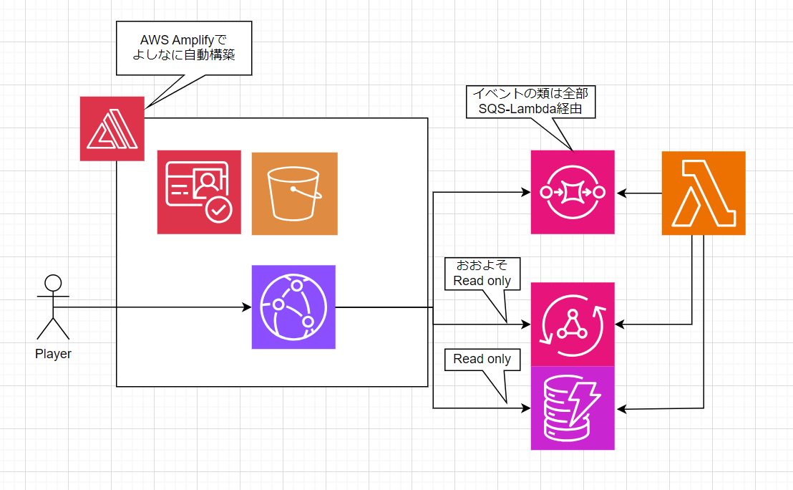

This is a [Next.js](https://nextjs.org) project bootstrapped with [`create-next-app`](https://nextjs.org/docs/app/api-reference/cli/create-next-app).

archive for serverless chat app

## できること

ルーム指定してチャットができた

## architecture

リリースされたてホヤホヤのAppSync Events APIを使ってWeb Socket部分をサーバレスに実装。

DynamoDB使ってないな・・・履歴取得作ってないから。
